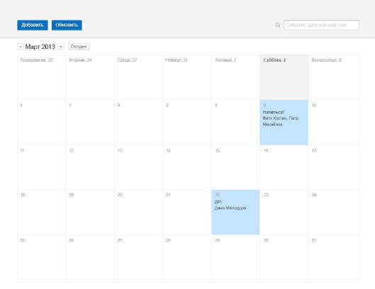
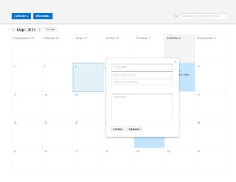
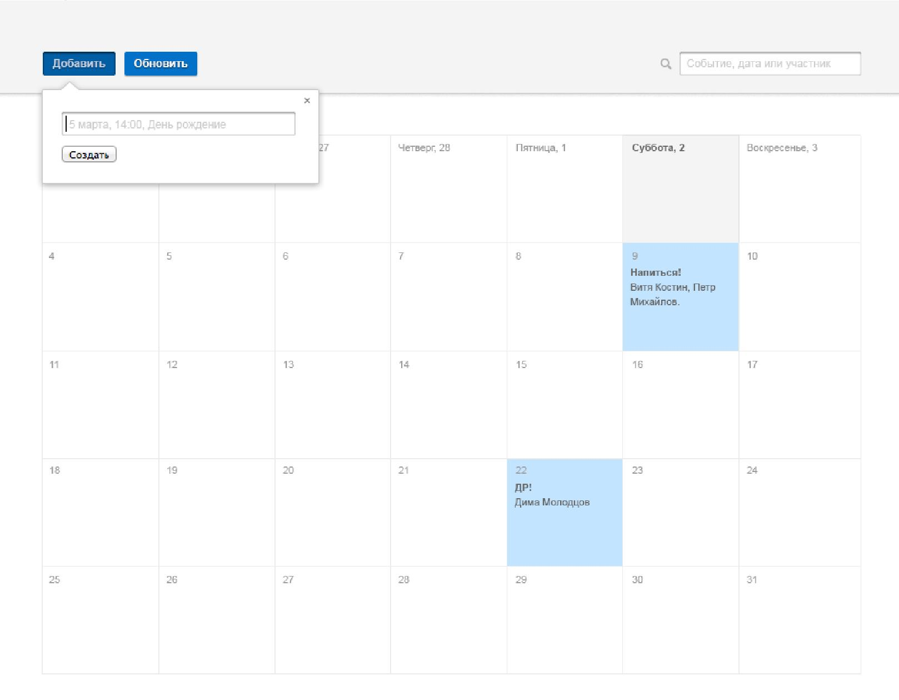
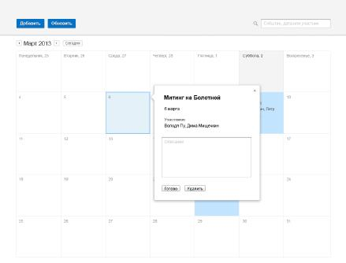
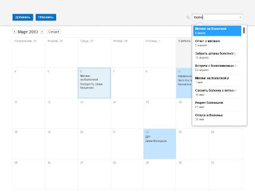

# Тестовое задание для разработчика frontend

[Смотреть результаты](https://verespro.github.io/Homework-WSL/)

Сверстать страницу календаря в соответствии с макетом ниже. Серверной части программировать не надо. Необходимо решить задание без использования сторонних JS/CSS-библиотек. Результат разместите на GitHub и в письме пришлите ссылку на GitHub pages. 

Плюсом будет реализация любой дополнительной JS-логики работы календаря: 

+ добавление/редактирование событий 
+ переход по месяцам 
+ поиск 
+ сохранение календаря в localStorage

## Примеры дополнительной логики работы 

Добавление события

Быстрое добавление события

Просмотр события + редактирование описания

Поиск

